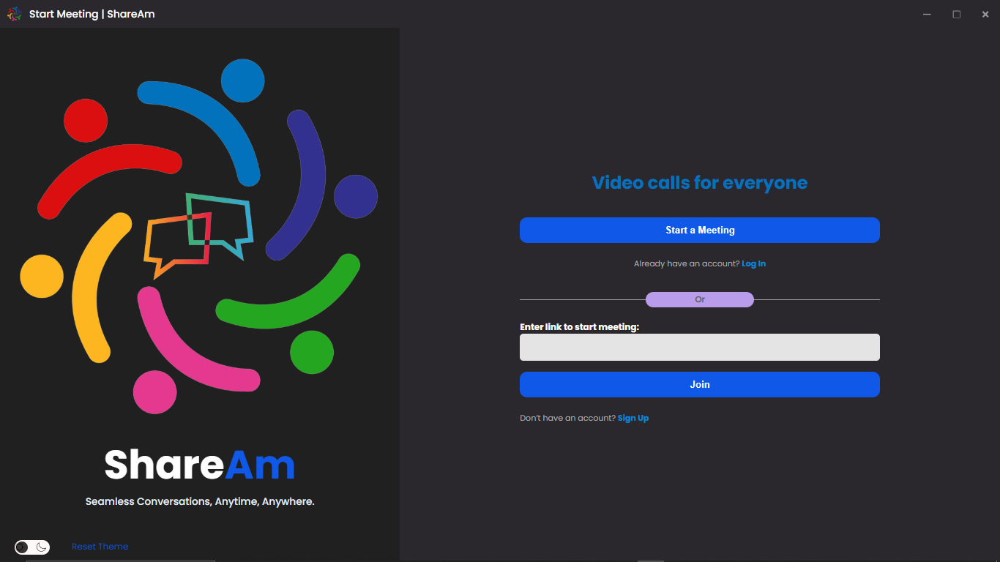
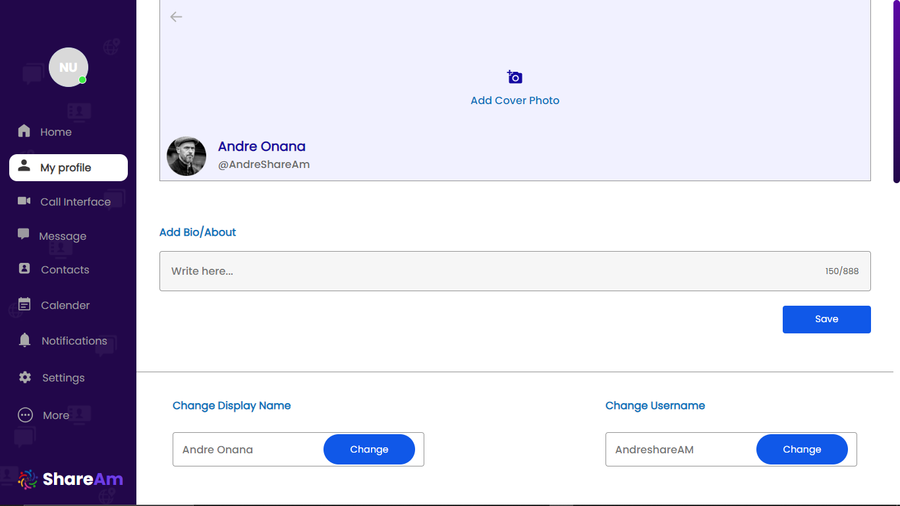

# ShareAm

### A desktop app to schedule and manage your meetings.

## Technologies

- HTML
- CSS
- Java Script
- Node.Js

## Introduction

**ShareAm** is an open-source app with real-time messaging, voice and video call features. It is a calling and messaging app that's designed to foster strong connections among users from various walks of life. This repo contains the source code for ShareAm App. ShareAm is a web-based video conferencing tool with a local, desktop client and a m that allows users to meet online; with or without video. ShareAm users can choose to record sessions,
collaborate on projects all with one easy-to-use platform. ShareAm offers quality video, audio, and a wireless screen-sharing performance.

### Project Snap Shots

## Features

- Meeting Scheduling
- High quality voice and video calling
- Video and Voice Conferencing
- Rich messaging (text, picture, video, audio, other files)
- One-on-one messaging and Group chat
- Message status and typing indicators
- Online status
- Push notifications
- Email notifications
- Disappearing message
- Light and Dark mode

## User Instructions

- User is expected to create an account if he/she doesn't have one.
  
- user can edit profile in the profile section
  
- you can either start a call or choose to chat by selecting any of the buttons responsible for either of the functions
  
